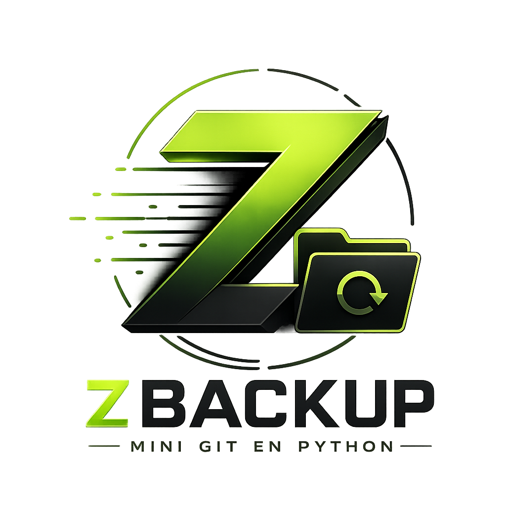

<p align="center">
  
</p>

<h1 align="center">ZBackup</h1>

<p align="center">
  <strong>A lightweight, fast and open-source backup manager written in Python.</strong>
  <br>
  Designed for simplicity while remaining powerful enough for everyday backups.
</p>

<p align="center">
  <a href="https://github.com/KirobotDev/ZBackup/stargazers">
    
  </a>
  <a href="https://github.com/KirobotDev/ZBackup/network/members">
    
  </a>
  <a href="https://github.com/KirobotDev/ZBackup/issues">
    
  </a>
  
  
</p>

---

# 📖 About

ZBackup is a lightweight and open-source backup utility written in Python.

It allows you to create, restore and manage backups directly from the terminal with a simple and intuitive interface.

The project is currently under active development and will continue to evolve with new features such as encryption, incremental backups, cloud synchronization and much more.

---

# ✨ Features

### ✅ Current

- 📦 Create ZIP backups
- 📂 List available backups
- ♻️ Restore backups
- 🗑 Delete backups
- 🖥 Windows support
- 🐧 Linux support
- 💻 Interactive terminal interface

### 🚧 Planned

- 🔒 Backup encryption
- ⚡ Incremental backups
- ☁️ Cloud storage
- 📊 Progress bars
- 📜 Backup history
- ⚙️ Configuration system
- 📁 Custom backup locations
- 🔄 Automatic scheduled backups

---

# 🛠 Built With

| Technology | Purpose |
|------------|---------|
| Python | Main language |
| pathlib | Path management |
| shutil | Backup creation |
| zipfile | Archive extraction |
| questionary | Interactive CLI |
| colorama | Terminal colors |
| platform | OS detection |
| sqlite3 | Future metadata storage |

---

# 📂 Project Structure

```text
ZBackup
│
├── image/
├── systeme/
│   ├── linux.py
│   └── win.py
├── setup.py
├── main.py
├── LICENSE
└── README.md
````

---

# 🚀 Installation

Clone the repository

```bash
git clone https://github.com/KirobotDev/ZBackup.git
```

Go into the project

```bash
cd ZBackup
```

Install dependencies

```bash
pip install -r requirements.txt
```

Run ZBackup

```bash
python main.py
```

---

# 📸 Preview

<p align="center">
Coming soon...
</p>

---

# 🗺 Roadmap

* [x] Windows support
* [x] Linux support
* [x] Backup creation
* [x] Backup restoration
* [x] Backup deletion
* [ ] zignore For choices ignore specify files
* [ ] Encryption
* [ ] Incremental backups
* [ ] Backup scheduler
* [ ] Cloud synchronization
* [ ] GUI version

---

# 🤝 Contributors

<a href="https://github.com/KirobotDev/ZBackup/graphs/contributors">
  
</a>

---

# 📊 Repository Stats

<p align="center">


</p>

---

# 📜 License

This project is licensed under the **MIT License**.

You are free to:

* ✔ Use the project
* ✔ Modify the source code
* ✔ Redistribute it
* ✔ Use it in personal or commercial projects

The only requirement is to include the original copyright notice and the MIT License.

See the **LICENSE** file for more information.

---

# ❤️ Support

If you enjoy this project, don't forget to leave a ⭐ on GitHub.

Every star helps the project grow!

---

<p align="center">

Made with Comminuty by <a href="https://github.com/KirobotDev">KirobotDev</a>
</p>

<p align="center">
Readme By AI
</p>
